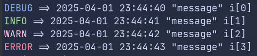

# logfmt

**logfmt** is used to format the Golang slog.NewJSONHandler.

## Install

You can install **logfmt** to your system using the Golang toolchain.

```bash
go install github.com/david-kalmakoff/logfmt
```

## Running

Once **logfmt** is installed, you can pipe in whatever program you are logging to Stdout using the slog.JSONHandler.

```bash
go run main.go | logfmt
```

## Example

The following slog.JSONHandler output:

```bash
{"time":"2025-04-01T23:43:16.805699864-05:00","level":"DEBUG","msg":"message","i":0}
{"time":"2025-04-01T23:43:17.806213056-05:00","level":"INFO","msg":"message","i":1}
{"time":"2025-04-01T23:43:18.806510701-05:00","level":"WARN","msg":"message","i":2}
{"time":"2025-04-01T23:43:19.806646845-05:00","level":"ERROR","msg":"message","i":3}
```

Will be transformed into:


